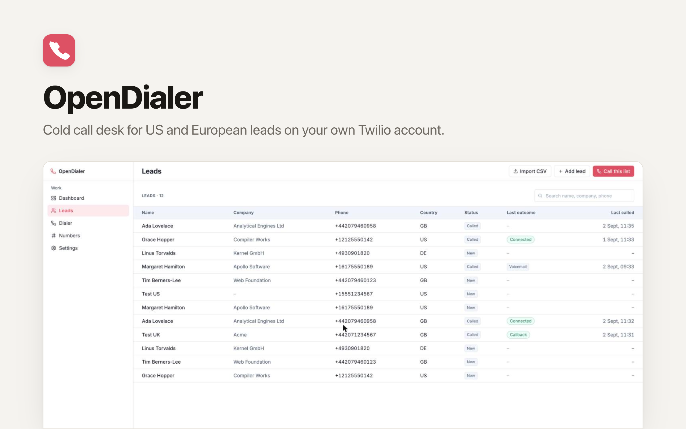

<p align="center">
  <picture>
    <source media="(prefers-color-scheme: dark)" srcset="./readme-banner-dark.png">
    
  </picture>
</p>

# OpenDialer: The Open-Source Cold Call Desk

[](https://app.clawnify.com/deploy?repo=clawnify/OpenDialer)

Open a lead list, click **Call**, talk through your browser, show a local caller ID in the US or Europe, and log every attempt. Runs on your own Twilio account, so you pay carrier rates and nothing per seat. An open-source app template provided by [Clawnify.com](https://clawnify.com).

Built with **React + Tailwind** on a **Hono API** and a **SQLite** database. Path-based routing, UUID keys, a dark mode that follows the OS, and a full OpenAPI surface so an agent can prepare lists and read call logs.

## What it does

- **Leads**: add, edit, delete, search. CSV import with phone normalisation to E.164; bad rows are counted and reported, not silently dropped.
- **Click-to-call from the browser** with the Twilio Voice SDK. Microphone and speaker in the page, nothing to install.
- **Local presence**: pick a caller ID, or let the app choose a number in the lead's country (matching US area code first). It never shows a foreign number when a local one exists.
- **Live status**: initiated, ringing, in progress, completed, failed, no answer, busy, with a timer.
- **Outcomes** after every call: Connected, Voicemail, No answer, Busy, Wrong number, Not interested, Callback, Do not call.
- **Call history** per lead with duration and recording playback.
- **Campaigns**: pick a list and work it one lead at a time. You click **Next**; nothing auto-dials.
- **Recording on by default**, with a per-rep switch in Settings. Audio stays at Twilio; the app keeps the link, the length, and streams it through its own player.
- **Fallback mode** when browser calling is not configured: Twilio calls your phone first, then bridges you to the lead.

Not in this version, on purpose: predictive or parallel dialing, AI voices, SMS or email sequences, billing, multi-tenant white-label, auto-dialing without a human click. A human is on the line for every conversation.

## Markets

US and Canada, the UK and Ireland, and 14 European countries: DE, FR, ES, IT, NL, BE, AT, CH, SE, NO, DK, FI, PL, PT. Numbers from other regions are rejected before dialing.

## Setup

The app needs an upgraded (paid) Twilio account with at least one voice-capable number: Twilio's trial program strips the `<Dial>` that bridges a call to a phone. [SETUP.md](SETUP.md) walks through the console: number, API key, TwiML App, geographic permissions, and the environment variables.

```
TWILIO_ACCOUNT_SID      required
TWILIO_AUTH_TOKEN       required
TWILIO_FROM_NUMBER      optional pin for the default caller ID; else the first synced number
TWILIO_TWIML_APP_SID    browser calling
TWILIO_API_KEY_SID      browser calling
TWILIO_API_KEY_SECRET   browser calling
PUBLIC_APP_URL          optional; the request origin is used by default
```

Missing variables show up as a banner and on **/settings**, never as a blank page. Secrets are never sent to the browser.

### Where each value comes from

Twilio is the only provider today. Every value in `.dev.vars.example` maps to one place in the [Twilio Console](https://console.twilio.com):

| Variable | Twilio console | Notes |
|---|---|---|
| `TWILIO_ACCOUNT_SID` | Console home → Account Info → **Account SID** | Starts with `AC` |
| `TWILIO_AUTH_TOKEN` | Console home → Account Info → **Auth Token** (click Show) | Also signs the webhooks the app verifies |
| `TWILIO_FROM_NUMBER` | Phone Numbers → Manage → **Active numbers** | Optional pin, E.164. Without it the first synced number is the default |
| `TWILIO_API_KEY_SID` | Account → Keys & Credentials → API keys & tokens → **Create API key** (type Standard) | Starts with `SK`. Not the Account SID |
| `TWILIO_API_KEY_SECRET` | Same dialog, shown once | Copy it before closing |
| `TWILIO_TWIML_APP_SID` | Voice → Manage → **TwiML apps** → your app | Starts with `AP`. Its voice URL must be `https://<your app host>/api/twilio/voice` |
| `TWILIO_REGION` | Console region selector (top right on credential pages) | `us1` (default) or `ie1`. See Ireland region below |
| `PUBLIC_APP_URL` | not from Twilio | Only for a tunnel during local development |

The two pairs are easy to swap and the symptom is the same either way, "The Twilio token was rejected": the **Account SID + Auth Token** identify the account and sign webhooks; the **API key SID + secret** sign the browser's Voice token. On Clawnify the first pair goes under Settings → API Keys → Twilio as `ACCOUNT_SID:AUTH_TOKEN`, the other four under Settings → Environment Variables. Step-by-step clicks, including the account upgrade and business-profile approval Twilio requires before Voice works: [SETUP.md](SETUP.md).

### Ireland region (EU data residency)

Set `TWILIO_REGION=ie1` to keep call processing, recordings and the browser media path inside Twilio's Ireland region. A region is a whole credential set, not a switch:

- The Account SID is the same, but the **Auth Token, API key and TwiML App are region-specific**. Create all three inside the Ireland region of the console: the pages live under `https://console.twilio.com/ie1/…` (API keys: `/ie1/account/keys-credentials/api-keys`, TwiML Apps: `/ie1/develop/voice/manage/twiml-apps`), and the page badge says "Ireland (IE1) Region". Put the IE1 values in the variables above.
- The app then talks to `api.dublin.ie1.twilio.com`, signs Voice tokens for IE1, and connects the browser through the Dublin edge.
- Each phone number's inbound processing region must be Ireland as well (Phone Numbers → the number → Voice region, or the Inbound Processing Region API); changes take up to five minutes.
- One deployment runs in one region. To serve both markets with residency guarantees, deploy the app twice.

## Pages

| Path | What |
|---|---|
| `/` | Leads to call today, callbacks due, last 20 calls, **Start calling** |
| `/leads` | Table with search, add lead, CSV import, **Call this list** |
| `/leads/:id` | Lead detail, call history, recordings |
| `/dialer` | The working screen: lead card, caller ID picker, Call / Hang up, timer, outcomes, next lead |
| `/numbers` | Caller IDs owned by the Twilio account, with a sync button |
| `/settings` | Provider status, default number, webhook URLs, your callback number |

## CSV format

```
first_name,last_name,company,phone,country,notes
Ada,Lovelace,Analytical Engines Ltd,+44 20 7946 0958,GB,Asked for a demo
Grace,Hopper,Compiler Works,(212) 555-0142,US,Prefers mornings
```

`phone` may be national format when `country` is filled. See [leads.sample.csv](leads.sample.csv).

## How a call works

1. **Call** → `POST /api/calls` validates the lead, picks the caller ID, creates a call record, and returns a short-lived Voice token.
2. The browser connects through the Twilio Voice SDK; Twilio asks `POST /api/twilio/voice` for TwiML, which bridges the browser to the lead's number with recording on.
3. Twilio reports each status change to `POST /api/twilio/status` and the finished recording to `POST /api/twilio/recording`. Every webhook is signature-checked against the auth token.
4. The page polls the call once a second until it ends; you save an outcome, then click **Next**.

The telephony layer lives in one file (`src/server/twilio.ts`) behind a small surface: list numbers, create call, end call, fetch recording, access token, TwiML. Another carrier can be added behind the same shape without touching the UI.

## Compliance

You are placing live outbound calls. You are responsible for complying with US TCPA, DNC rules, and European GDPR/ePrivacy and country-specific calling rules. Recording laws vary. Get required consent. The app shows this reminder on the dialer; it does not make you compliant.

## Local development

```bash
pnpm install
cp .dev.vars.example .dev.vars   # fill in Twilio values
pnpm dev                          # UI on :5173, API on :8789
pnpm seed                         # optional demo leads
pnpm test
```

Twilio must reach your webhooks. For local calls, expose port 8789 with a tunnel and set `PUBLIC_APP_URL` to the tunnel URL.

## API

Every endpoint is described at `/llms.txt` and `/api/openapi.json`. Lists are paginated.

| Method | Path | |
|---|---|---|
| GET | `/api/health` | Liveness and provider status |
| GET, POST | `/api/leads` | List (search, status, country) and create |
| GET, PATCH, DELETE | `/api/leads/:id` | One lead with history |
| POST | `/api/leads/import` | CSV import, returns imported / rejected / duplicates |
| GET | `/api/numbers` · POST `/api/numbers/sync` | Caller IDs |
| POST | `/api/token` | Voice SDK token |
| GET, POST | `/api/calls` | Call log; start a call |
| GET | `/api/calls/:id` | Poll a live call |
| POST | `/api/calls/:id/hangup` · `/api/calls/:id/outcome` | End; record outcome |
| GET | `/api/calls/:id/recording` | Streams the recording through the server's auth |
| GET, POST | `/api/campaigns` · `/api/campaigns/:id/next` · `.../leads/:leadId/complete` | Power-dialer queue |
| POST | `/api/twilio/voice` · `/status` · `/recording` | Twilio webhooks (public, signature-checked) |

## License

MIT
