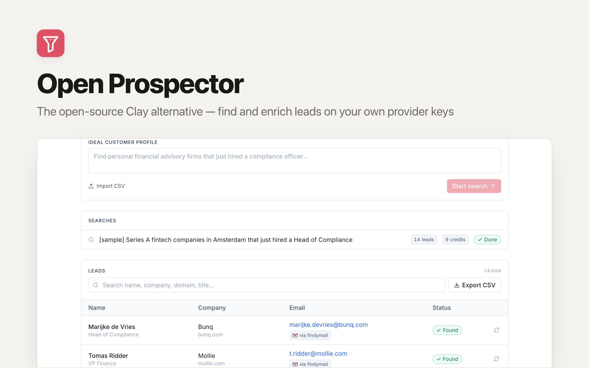

# OpenProspector: The Open-Source Clay Alternative for Lead Enrichment

[](https://app.clawnify.com/deploy?repo=clawnify/OpenProspector)

Find B2B leads and enrich them with **your own provider keys** — at vendor cost, with no per-lead markup. An open-source app template provided by [Clawnify.com](https://clawnify.com).

Built with **React + Tailwind** on a **Hono API** and a **SQLite** database. Path-based routing, UUID keys, a dark mode that follows the OS, and a full OpenAPI surface so agents can drive it.

## What Is It?

Lead-enrichment SaaS resells contact data. Clay, Apollo, and the newer AI prospecting tools buy credits wholesale from a handful of data vendors and charge you a marked-up per-lead price on top — typically **$0.10–$0.15 per lead**.

OpenProspector inverts that. You bring your own vendor keys, you pay the vendor directly, and the app does the part that actually carries the value: **orchestrating the waterfall**. Try the cheapest provider first, validate the result, fall through to the next one only if it missed, never buy the same person twice.

The savings are not theoretical:

| | Per-lead SaaS | OpenProspector (BYO key) |
|---|---|---|
| Cost per verified email | ~$0.12 | **~$0.02** |
| Re-checking a lead you already own | Full price again | **Free** (cached) |
| Where your contact data lives | Their cloud | Your database |
| Provider order | Fixed | Yours to configure |

> **Where this *doesn't* win.** Most vendors sell credits on a monthly floor — Findymail's entry plan is $99/mo for 5,000 credits. Below roughly **800 leads/month**, a usage-priced SaaS is genuinely cheaper. This template is for teams doing real volume.

## Providers

Each field has its own independently-ordered waterfall. The order below is the shipping default; **you can reorder any of it in the UI**, and you should — the optimal order depends on which vendors you already pay for and how your ICP resolves.

Every adapter is written against the vendor's own published contract, and its response mapping is covered by tests: a hit, a miss, a rejected key, and the eligibility gate that decides whether the vendor is called at all. Getting those confused is what makes a waterfall either stop resolving or quietly keep spending.

### Email waterfall

| # | Provider | Cost on a hit | Verified? | Needs |
|---|----------|---------------|-----------|-------|
| 1 | **Findymail** | 1 credit | ✅ | name + domain |
| 2 | **LeadMagic** | 1 credit | ✅ | name + domain/company |
| 3 | **Anymail Finder** | 1 credit, **only when valid** | graded | profile URL, or name + company |
| 4 | **Hunter** | 1 credit | graded (SMTP) | name + domain/company |
| 5 | **Skrapp** | 1 credit | graded (SMTP) | name + domain/company |
| 6 | **Tomba** | 1 credit | graded | name + domain/company |
| 7 | **Datagma** | 1 credit, **only when verified** | graded (SMTP) | name + domain/company |
| 8 | **Prospeo** | 1 credit | ✅ | profile URL, email, or name + company |
| 9 | **Wiza** | ~2 credits | graded | profile URL, email, or name + company |
| 10 | **Apollo** | 1 credit | graded | profile URL, email, or name + company |
| 11 | **People Data Labs** | 1 match | ❌ dataset | profile URL, email, or name + company |
| 12 | **ContactOut** | 2 credits | graded | profile URL, email, or name + company |
| 13 | **Forager** | 1 credit | graded | profile URL |

Positions 3–7 are grouped deliberately: **each of those vendors bills only when it actually returns an address**, so an attempt that misses costs nothing. A vendor that is free to try belongs ahead of one that charges whether or not it resolves. Apollo sits behind them because it charges on a match even when the address it returns is a `guessed` one.

### Phone waterfall

| # | Provider | Cost on a hit | Needs |
|---|----------|---------------|-------|
| 1 | **Forager** | 1 credit | profile URL |
| 2 | **People Data Labs** | 1 match | profile URL, email, or name + company |
| 3 | **Datagma** | as reported per call | profile URL, email, or name + company |
| 4 | **LeadMagic** | 5 credits | profile URL **or work email** |
| 5 | **Wiza** | ~5 credits | profile URL, email, or name + company |
| 6 | **ContactOut** | 2 credits | profile URL, email, or name + company |
| 7 | **Prospeo** | 10 credits | profile URL, email, or name + company |

Datagma prefers a **mobile** over a switchboard number and reports its own `creditBurn` on every call, so its real cost lands in the ledger rather than an assumed list price.

Phone credits cost meaningfully more than email — Prospeo prices a mobile at **10×** an email — which is why the phone waterfall runs deeper before giving up, and why ordering it well matters more.

**The phone waterfall runs on the email waterfall's output.** Most phone vendors key on a work email or a profile URL, not on a name and a domain, so a freshly sourced lead has nothing they can match. The runner therefore resolves email first and feeds the result forward as an input. Without that, four of the seven phone vendors could never run at all.

### Not shipped

Most of these share one blocker, and it is worth stating once: **their enrichment API does not answer in the same request.** You POST, you get an id, and the result arrives later by webhook or by polling. This waterfall is synchronous by necessity: it decides whether to spend a credit at the next vendor based on whether this one resolved the field, so it cannot proceed without an answer in-band. Supporting any of them is one deferred feature (a pending-enrichment table, a public callback route, out-of-band lead and ledger writes) that would unlock the whole list at once, which is why they are recorded together rather than each half-built.

| Provider | Why |
|----------|-----|
| Dropcontact | Batch-only API: a POST returns a request id, and results are fetched by a later GET. |
| RocketReach | Lookups come back `searching` / `waiting` and complete out of band, needing polling or a webhook. |
| Surfe | Enrichment returns an `enrichmentID` immediately; results arrive by polling or webhook. |
| Snov.io | Task-based: a POST to `/start` returns a `task_hash`, and the result is fetched from `/result`. |
| Zeliq | Both enrichment endpoints require a `callback_url` and deliver only as a webhook, minutes later. There is no synchronous mode. |
| Bytemine | Shipped once, now parked. `api.bytemine.ai` is a CNAME onto an AWS API Gateway custom domain that stopped serving TLS for that hostname on 2026-09-01: against the same IP in the same second, the gateway's own SNI name completes a TLS 1.3 handshake while `api.bytemine.ai` gets alert 40. Server-side and client-independent, reproduced from three TLS stacks. The adapter and its tests are kept, so reviving it is one line once the handshake works again. |
| Kaspr | The second odd one out. Kaspr *is* synchronous and self-serve, so it is not blocked by the above. What is missing is the contract: its request is documented, but its response schema is not published anywhere retrievable (the reference renders client-side and the developer docs host does not respond). Guessing which field holds the email and which the mobile reads as "Kaspr never has data for anyone" rather than as a bug. It needs one live call against a real key to pin, then it is a normal adapter. |

**Apollo ships for email only**, for the same structural reason: `reveal_phone_number` requires a `webhook_url`, and Apollo documents that the phone numbers are delivered to it asynchronously. Declaring `phone` on that adapter would produce a provider that is always called, always charged, and never resolves.

### Two keys that are not a plain token

- **Forager** puts the account id in the URL path, so its secret is stored as `FORAGER_API_KEY=accountId:apiKey`.
- **Tomba** authenticates with two headers (`X-Tomba-Key` and `X-Tomba-Secret`), so its secret is stored as `TOMBA_API_KEY=key:secret`.
- Every other vendor takes an opaque key. The settings screen shows the expected shape next to each field.

### Adding a provider

An adapter is one file. Implement `EnrichProvider` in `src/server/providers/`, add it to `REGISTRY`, and it appears in the UI with its own key field and reorder controls:

```ts
export const MyProvider: EnrichProvider = {
  id: "myvendor",
  label: "My Vendor",
  fields: ["email"],
  secretName: "MYVENDOR_API_KEY",   // never a literal key in app code
  signupUrl: "https://myvendor.com/api-keys",
  requirements: () => ["fullName", "domain"],
  async find(field, input, apiKey) { /* → EnrichResult */ },
};
```

Adapters are pure request/response wrappers with no app coupling — no database, no caching, no ordering logic. The runner owns all of that, which is what keeps the registry cheap to extend.

## How a Search Runs

Sourcing and enrichment are deliberately different jobs, and this app only does one of them.

1. **You describe an ICP** — "marketing agencies in Amsterdam, reach the creative director".
2. **Your agent sources.** The app hands the search to your agent, which researches the live web — maps and review sites, job boards, funding news, professional profiles — and posts back a named person, a company domain, and *one line of evidence* for why each lead qualifies. That work needs judgment and a real browser, so it does not run inside the app.
3. **The app enriches.** Every sourced lead goes through the provider waterfall below to resolve a verified email or phone, on your keys, at vendor cost.
4. **You export.** CSV, or a POST to your CRM or sequencer.

Progress shows up on the search itself — sourcing, enriching, done — including a **stalled** state if the agent stops reporting, so a search that died is never mistaken for one still working.

If the app can't reach your agent, it hands you the brief to paste into your agent's chat instead. The search is saved either way, and can be retried.

## How the Waterfall Works

1. **Cache first.** A normalized `(field, name, domain)` key is checked before any vendor call. A hit costs nothing.
2. **Skip what can't help.** Providers with no API key, or missing the inputs they need, are skipped without spending — and *recorded* as skipped, so you can see exactly why coverage looked thin.
3. **First verified result wins.** An unverified value is kept as a fallback but does **not** stop the search, and is never cached — so a better-configured waterfall can retry it later.
4. **Everything is logged.** Every attempt writes provider, outcome, credits, and latency to an append-only ledger. "Why did this lead resolve this way, and what did it cost?" is always answerable.

Cached values expire after **90 days**. Contact data decays as people change jobs, and an unbounded cache would serve confidently-"verified" dead addresses straight into your bounce rate.

## Features

- **Agent-run sourcing** — describe an ICP and your agent researches the live web; progress and failures surface on the search
- **Configurable waterfalls** — independent provider order per field, editable in the UI
- **Enrichment cache** — never buy the same contact twice, with a staleness cap
- **Cost ledger** — per-provider outcome and credit breakdown; spend is read back from the ledger, so a crashed job can't under-report
- **Provider attribution** — every enriched cell shows which vendor produced it
- **CSV import** — bring a list you already have; column headers are matched loosely
- **LinkedIn Matched Audiences export** — contact and company lists in exactly the header shape Campaign Manager expects, so an enriched search becomes an ad audience without a spreadsheet in between
- **Batch enrichment** — large lists process as chained background jobs, safe against redelivery
- **Full OpenAPI** — `/api/openapi.json` and `/llms.txt` for agent-driven use
- **Dark mode** that follows the OS

## What This Deliberately Does Not Do

**It does not send email.** No sequencer, no SMTP, no "enroll 20 leads" button — not even bring-your-own.

That is a considered decision, not a missing feature. Cold-email sending at volume is a deliverability and compliance problem (CAN-SPAM, GDPR) that belongs in a tool you have configured, warmed, and are accountable for. OpenProspector's job ends at a verified, attributed contact record; export it to your CRM or your own sequencer and send from there.

## Quickstart

```bash
git clone https://github.com/clawnify/OpenProspector.git
cd open-prospector
pnpm install

cp .dev.vars.example .dev.vars   # add whichever provider keys you have
pnpm dev                          # UI on :5175, API on :8789
```

Every provider is optional. With no keys at all the app still runs — the waterfall records `unconfigured` for each vendor so you can see what a key would buy you.

```bash
pnpm test        # waterfall ordering, eligibility, cache and TTL behaviour
pnpm typecheck
pnpm build

# Opt-in, and not part of CI: calls every adapter against the real vendor with a
# deliberately invalid key. Spends nothing, and proves the half a stubbed test
# cannot see: that the host, path, API version and auth header are right, rather
# than only that the response mapping is.
LIVE_PROVIDER_CHECK=1 pnpm test
```

## API

All list endpoints are paginated (`?page=`, `?limit=`, max 100) and searchable — no endpoint returns an unbounded collection.

| Method | Path | Purpose |
|--------|------|---------|
| `GET` | `/api/providers?credits=true` | Registry, configuration state, remaining balances |
| `PUT` | `/api/waterfall/{field}` | Set provider order for `email` or `phone` |
| `POST` | `/api/runs` | Start a search from an ICP description |
| `GET` | `/api/runs`, `/api/runs/{id}` | List runs; one run with live credit spend |
| `POST` | `/api/runs/{id}/enrich` | Queue enrichment for a run's pending leads |
| `POST` | `/api/leads` | Import leads (CSV or an existing list) |
| `GET` | `/api/leads`, `/api/leads/{id}` | List leads; one lead with its attempt log |
| `POST` | `/api/leads/{id}/enrich` | Enrich one lead (`?refresh=true` to re-buy) |
| `GET` | `/api/export/leads.csv` | Download leads as CSV (bounded; page with `offset`) |
| `GET` | `/api/export/leads.csv?format=linkedin-contacts` | LinkedIn Matched Audiences **contact** list |
| `GET` | `/api/export/leads.csv?format=linkedin-companies` | LinkedIn Matched Audiences **company** list, deduplicated |
| `POST` | `/api/export/push` | POST leads to a CRM, sequencer, or webhook you control |

**Push safety.** The destination is caller-supplied, so it is validated before anything is sent: **https only**, public hosts only (loopback, private ranges, carrier-grade NAT, IPv6 unique/link-local, `.local`/`.internal`, and cloud metadata addresses are all refused), hop-by-hop and `Host` headers stripped, header-injection attempts dropped, and **redirects refused rather than followed** — a permitted host must not be able to bounce your contact data onward.

## License

MIT — see [LICENSE](LICENSE).
